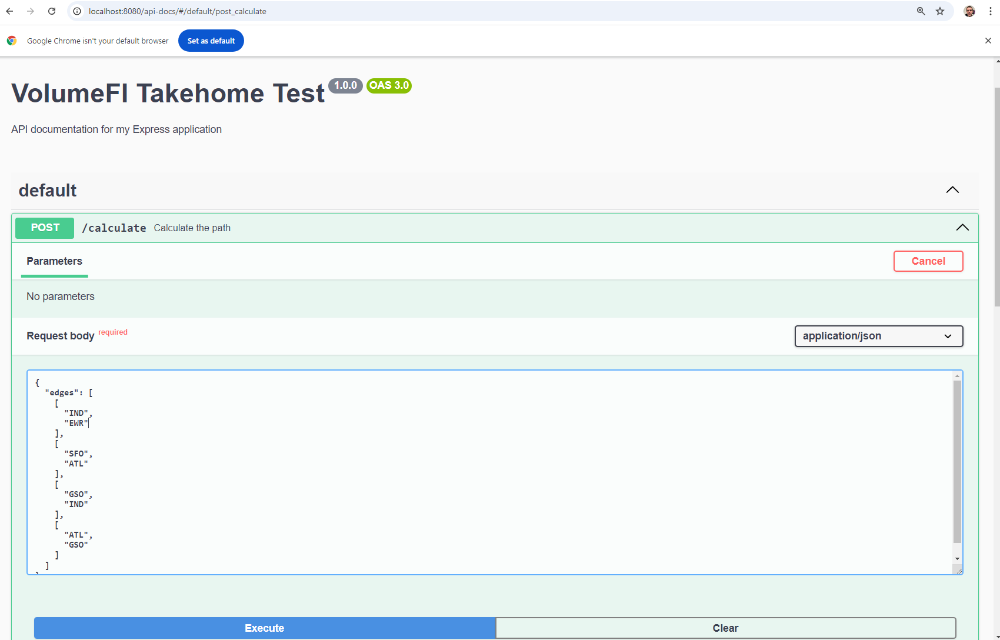

# VolumeFi

Story: There are over 100,000 flights a day, with millions of people and cargo being transferred worldwide. With so many people and different carrier/agency groups, tracking where a person might be can be hard. To determine a person's flight path, we must sort through all of their flight records.

Goal: To create a microservice API to help us understand and track how a particular person’s flight path may be queried. The API should accept a request that includes a list of flights defined by a source and destination airport code. These flights may not be listed in order and must be sorted to find the total flight paths starting and ending at airports.

```text
Examples: 
[['SFO', 'EWR']]                                                 => ['SFO', 'EWR']
[['ATL', 'EWR'], ['SFO', 'ATL']]                                 => ['SFO', 'EWR']
[['IND', 'EWR'], ['SFO', 'ATL'], ['GSO', 'IND'], ['ATL', 'GSO']] => ['SFO', 'EWR']
```

## Setup your local environment

This project uses a multi-stage Dockerfile to streamline the development processes. You can start at of the following stages:

- **base**: npm package installation and environment setup
- **build**: run the TypeScript compilation and related operations
- **test**: run the unit tests and view the results
- **debug**: launch under nodemon with remote debugging
- **prod**: standard image for production

## Running Unit Tests
To run unit tests, use the test target:

> docker run --rm vol:test

## Debugging for Developers
To set up the debugger for development, use the debug target. This will start the application with nodemon and enable debugging on port 9229:

> docker run -p 9229:9229 -v $(pwd):/usr/src/app my-node-app:debug

## Running in Production

To run the application in production mode, use the production target. This will start the application and listen on port 8080:

> docker run -p 8080:8080 my-node-app:production

## Connecting to the service

The API is available on `localhost:8080` by default (configurable using the `PORT` environment variable).

You can access the calculator using `curl` or related client.
> curl -X 'POST' \
  'http://localhost:8080/calculate' \
  -H 'accept: */*' \
  -H 'Content-Type: application/json' \
  -d '{
  "edges": [
    [
      "IND",
      "EWR"
    ],
    [
      "SFO",
      "ATL"
    ],
    [
      "GSO",
      "IND"
    ],
    [
      "ATL",
      "GSO"
    ]
  ]
}'

Alternatively a Swagger API endpoint is available for testing the service on  http://localhost:8080/api-docs/#/default/post_calculate.



